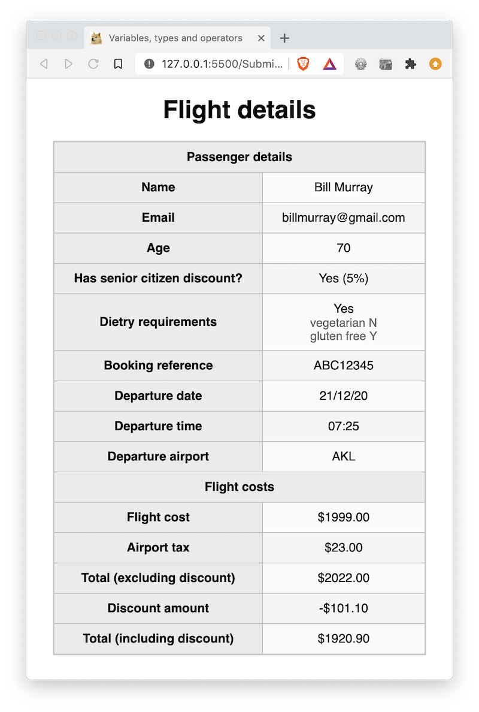

# 01 Exercise - Variables, Types & Operations

## Brief

Display a customers Flight Details by completing the required variables in JavaScript



## Rationale

Practice declaring JavaScript variables, and assigning them values. This will build muscle memory, get you familiar with the terms used when describing variables, and allow you to practice using operators in JavaScript.

## Instructions Part A - Write variables in JavaScript

1. Open `/Submission/index.html` in Live Server, so it opens in your browser. You **do not** need to open this file in VS Code.
2. Open `/Submission/static/js/script.js` in VS Code
3. Underneath each comment block, complete the instructions in the comment. After each variable declaration, you should see the web page update with the value you set
4. Complete all the instructions in `script.js` until your web page looks like the brief

**Acceptance criteria**

- The values populated in your web page match the values from the screenshot in the brief

---

## Automated tests

This exercise contains tests that check your code is correct. If you want to run the tests yourself, you can type the following into your terminal:

Use the following command once. This will install all the required dependencies to run the tests:

```shell
npm install
```

You can then run the test command as many times as you like:

```shell
npm run test:acceptance
```

---

# Submit your Exercise

- [ ] Commits are pushed to GitHub
- [ ] Automated tests pass in GitHub

---

## Exercise answer walkthrough

- [Variables, Types and Operations exercise walkthrough](https://www.loom.com/share/68077aa455a84af4a1e768f83f768b98)
